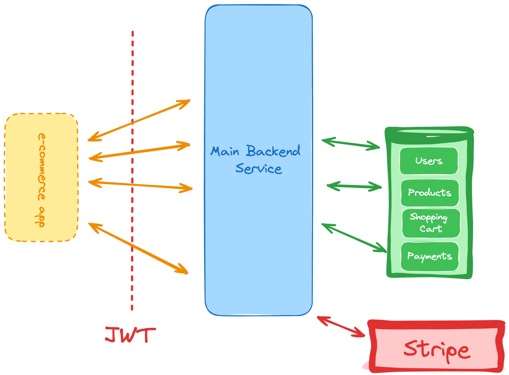

# E-Commerce API

This project is intended to be an implementation exercise that is based on the guidelines outlined here: https://roadmap.sh/projects/ecommerce-api

## Concept

(Credit: https://roadmap.sh/projects/ecommerce-api)

## Basic Functionality

* Ability for users to sign up and log in.
* Ability to add products to a cart.
* Ability to remove products from a cart.
* Ability to view and search for products.
* Ability for users to checkout and pay for products.

## Implementation (WIP)

* Monolithic NodeJS API